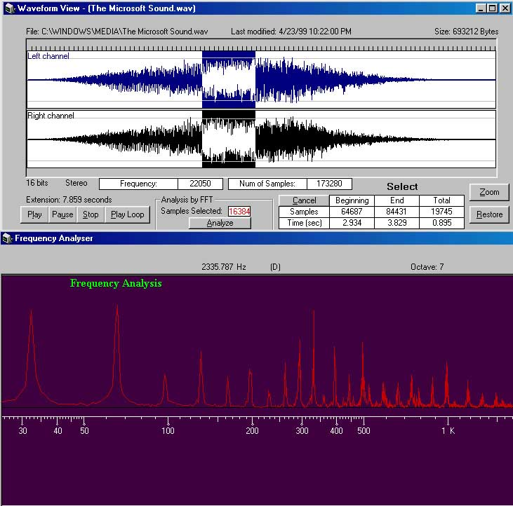



## TrueWavAnalyzer

### Description

This is the start of a Voice Stress Analyzer Project in VB. It's gonna be a Lie Detector... the Theory is a simple one, isolate the frequencies between the 7.8K and 12.8K Hertz Range. Analyze the variance of decibels, in this range, and any sharp rises indicate stress, or a "Lie". I decided that I needed to start with something that could, at least Isolate Frequencies. I Couldn't find anything like this on PSC, or anywhere else for that matter. So here it is, It's a Wave Frequency Analyzer. The Application lets you load .wav files of your choice, graphically sticks the "Scope" data, into picture box(es). From here you have Zoom, Loop & Selection Options. Selecting up to 32768 (The Single Pecision Dimensional Limit) samples which then are graphically analyzed by Frequency and Charted by Decibel. This Uses Fast Fourier Transform Concepts in Pure VB Form and quite quickly :) You set the start and stop markers, Partial wave Selection, Zoom and Loop functions mimic some commercially available products, such as Sonic Foundrys' Sound Forge. works on ALL WINDOWS Platforms and the Freq. Analyzer functions without a soundcard (since it's all binary reads). Also check out my TrueWavEditor & SampleStudio Projects Listed here on PSC as well.
 
### More Info
 

             |
---                |---
**Submitted On**   |2002-02-04 10:20:38
**By**             |[Zaphod](https://github.com/Planet-Source-Code/PSCIndex/blob/master/ByAuthor/zaphod.md)
**Level**          |Advanced
**User Rating**    |4.8 (174 globes from 36 users)
**Compatibility**  |VB 5\.0, VB 6\.0
**Category**       |[Complete Applications](https://github.com/Planet-Source-Code/PSCIndex/blob/master/ByCategory/complete-applications__1-27.md)
**World**          |[Visual Basic](https://github.com/Planet-Source-Code/PSCIndex/blob/master/ByWorld/visual-basic.md)
**Archive File**   |[TrueWavAna52857242002\.zip](https://github.com/Planet-Source-Code/zaphod-truewavanalyzer__1-31188/archive/master.zip)

